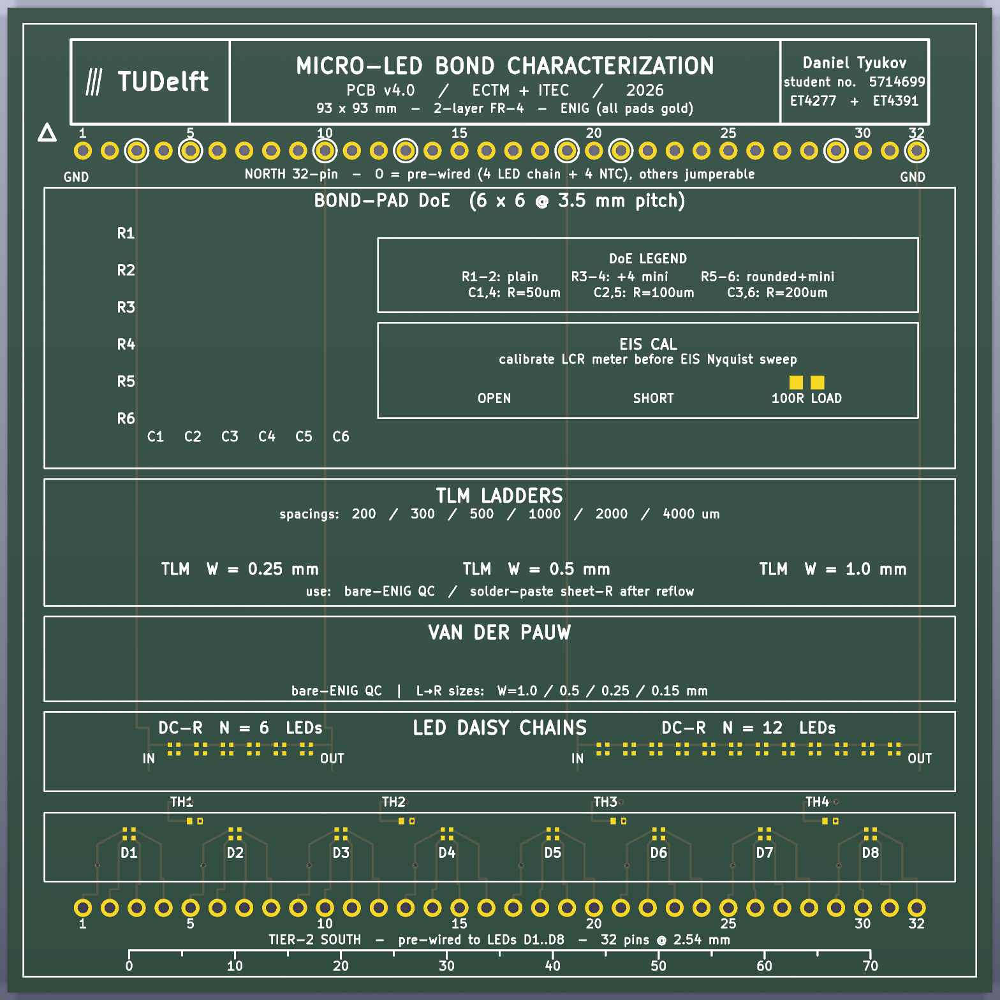

# tud-micro-led-bonding-categorization

Characterization of micro-LED / 1 mm² die bonding on PCB substrates.
Joint work: **TU Delft** (ECTM, M. Mastrangeli, H. van Zeijl, A. Abdelwahab)
and **ITEC B.V. / Nexperia** (R. van Hoorn, H. Kuipers). Financed by ITEC
B.V. and co-financed by the Netherlands Enterprise Agency (RVO).

**v2 PCB — fab-ready for Eurocircuits ("Place loose" components workflow), ENIG finish.**
26 RGB micro-LEDs (8 stand-alone + 6+12 daisy chains), 4 NTCs for V_F-TSP thermometry, 1 calibration resistor, and dual 32-pin breadboard interface. Components ship loose alongside the PCBs; LEDs are bonded at TU Delft EKL under the Tresky T-3000-PRO.

---

## Board overview



93 × 93 mm · 2-layer FR-4 · 1.55 mm · ENIG (Ni 4 µm / Au 0.075 µm) · white silk · green soldermask. DRC clean (0 violations, 0 unconnected, 0 schematic-parity). Solder-paste gerbers empty by design — no fab ever pre-tins the LED bond pads.

## What's in here

```
.
├── README.md                  ← you are here
├── PROJECT_DETAILS.md         ← deep dive: project context, v1 board, papers
├── docs/                      ← 4 component datasheets + papers + collaboration notes
│   ├── datasheets/
│   ├── ECTC-2025-published Ahmed Abdelwahab.pdf
│   ├── s41586-023-06167-5 (1).pdf       (Nature, capillary self-alignment)
│   ├── patent-published-2024-2026.pdf
│   ├── 150044M155220-RGB LEDs.pdf
│   └── Work with Ahmed.md
├── old-pcb/                   ← v1 board (ECTC-2025 paper), read-only reference
└── new-pcb/                   ← v2 board, FAB-READY
    ├── README.md
    ├── tud-microled-v2.kicad_*       KiCad 9.0.8 project
    ├── PCB_DESIGN_PLAN.md            original spec
    ├── V2_DESIGN_NOTES.md            as-built notes
    ├── VERIFICATION_v4.md            verification workflow
    ├── ELECTRICAL_CHARACTERIZATION.md measurement plan + lab tools
    ├── FABRICATION_ORDER.md          Eurocircuits "Place loose" order checklist
    ├── PUBLICATION_CONTRIBUTION.md   v2 contributions vs ECTC 2025
    ├── library/                      Würth WL-SFCC library
    ├── tools/                        BOM generator + one-time PCB patchers
    └── fab/                          gerbers, BOM, pos, PDFs, STEP, top render
```

## Where to start, by role

- **PCB designer / reviewer** → `new-pcb/README.md` then `new-pcb/V2_DESIGN_NOTES.md`
- **Fab / order placement (Filip)** → `new-pcb/FABRICATION_ORDER.md`
- **EKL / cleanroom (LED bonding step)** → `new-pcb/PCB_DESIGN_PLAN.md` §7, §9 + datasheet `docs/150044M155220-RGB LEDs.pdf`
- **Electrical characterization / lab planning** → `new-pcb/ELECTRICAL_CHARACTERIZATION.md`
- **Project context for new readers** → `PROJECT_DETAILS.md`, then `docs/ECTC-2025-published Ahmed Abdelwahab.pdf`
- **Reproducing the v1 results** → `old-pcb/` + `PROJECT_DETAILS.md` §2

## Status

| Component                      | Status                                              |
|--------------------------------|-----------------------------------------------------|
| v1 board (ECTC 2025)           | shipped                                             |
| Project context document       | done                                                |
| v2 design plan                 | done                                                |
| v2 KiCad project               | done (93 × 93 mm, 2-layer ENIG, DRC clean)          |
| v2 schematic                   | done (single-sheet A2, linked to PCB)               |
| v2 layout                      | done (33 footprints, 7 placements, 26 LEDs DNP)     |
| v2 fab outputs                 | done (gerbers + BOM + pos + PDFs + STEP + top.png)  |
| v2 fabrication                 | **ready to order** at Eurocircuits ("Place loose")  |
| v2 assembly + LED bonding      | EKL cleanroom session — pending fab delivery        |
| v2 electrical characterization | pending bonded boards                               |

## Quick fab order — Eurocircuits "Place loose"

Full step-by-step in `new-pcb/FABRICATION_ORDER.md`.

1. Upload `new-pcb/fab/tud-microled-v2-gerbers.zip` to **PCB visualiser** → 2-layer, 1.55 mm FR-4, **ENIG**, white silk, green mask, **10 boards**.
2. Add **PCBA service** → upload `new-pcb/fab/tud-microled-v2-fab-bom.csv` + `new-pcb/fab/tud-microled-v2-pos.csv`.
3. In eC-stencil-mate BOM editor, set every line's placement mode to **"Place loose"** (3 lines: Yageo R, Samtec header, TDK NTC).
4. The 26 LED rows are auto-filtered (`exclude_from_bom` flag in the PCB). They ship as bare ENIG gold pads only.
5. Lead time ~5-7 working days. Boards + loose-parts bag arrive together. Hand-solder NTC/R/header pins at TU Delft EKL, then bond LEDs under the Tresky.
