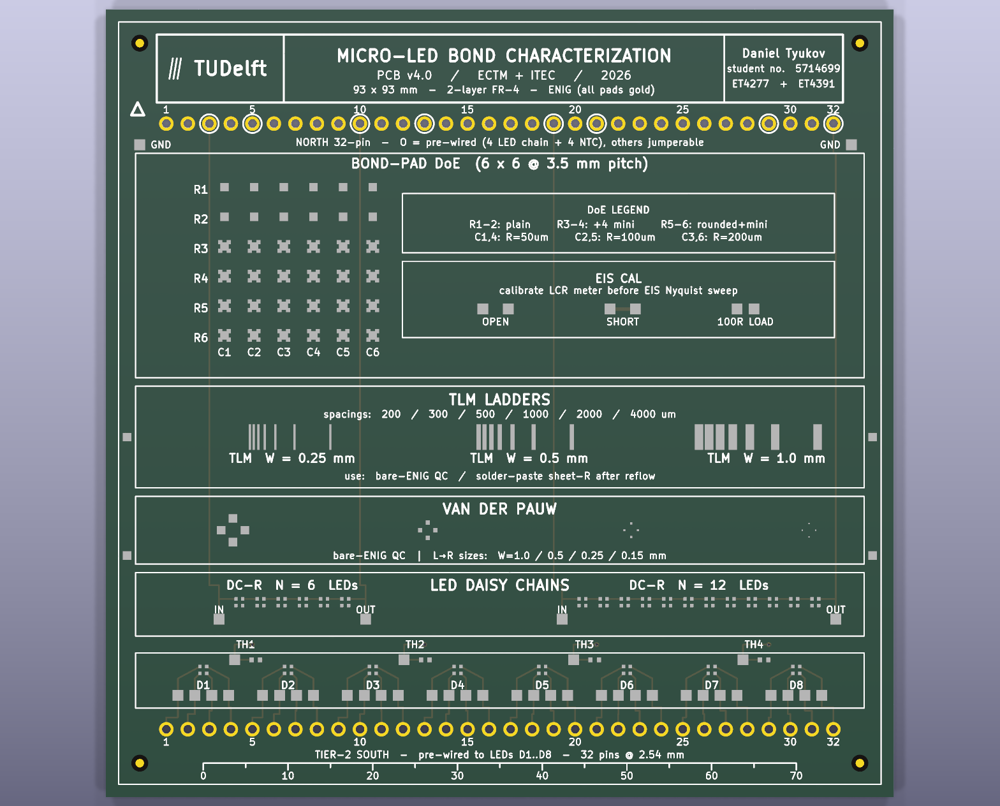
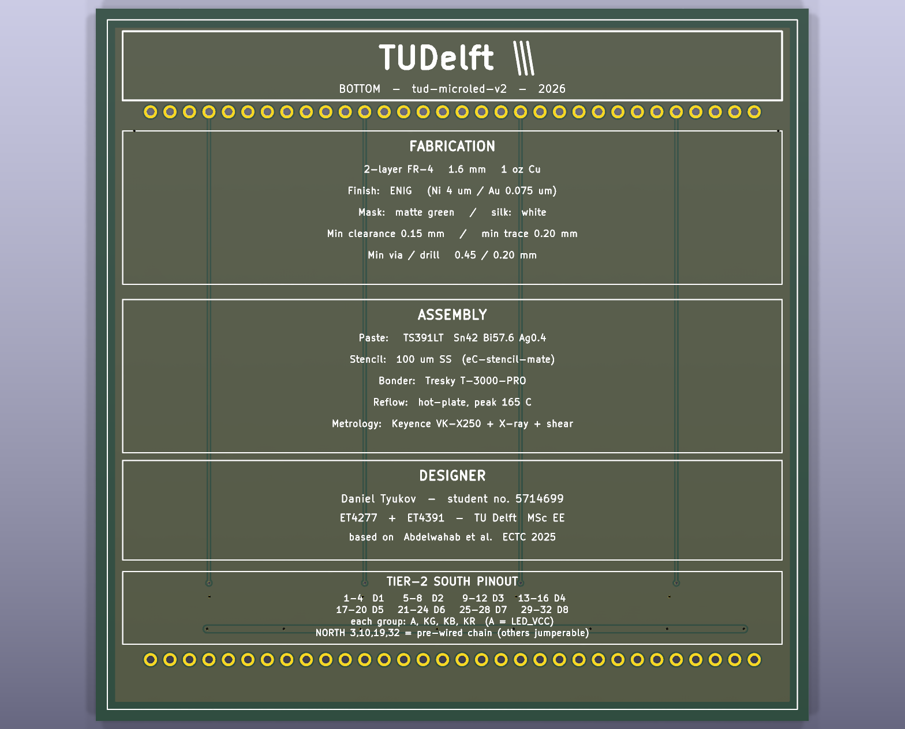
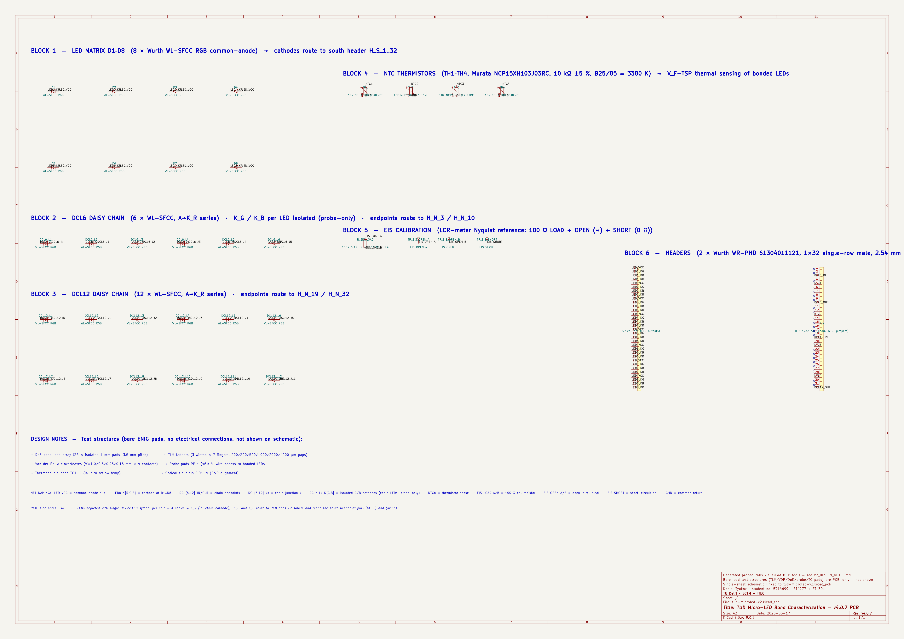

# tud-micro-led-bonding-categorization

Characterization of micro-LED / 1 mm² die bonding on PCB substrates.
Joint work: **TU Delft** (ECTM, M. Mastrangeli, H. van Zeijl, A. Abdelwahab)
and **ITEC B.V. / Nexperia** (R. van Hoorn, H. Kuipers). Financed by ITEC
B.V. and co-financed by the Netherlands Enterprise Agency (RVO).

**v4.0.7 PCB — fab-ready for Aisler or Eurocircuits standard pool, ENIG finish.**
26 RGB micro-LEDs (8 characterization + 6+12 daisy chains), 4 NTCs for
V_F-TSP thermometry, EIS calibration block, 64-pin breadboard interface,
plus bare-pad test structures for TLM / VDP / DoE on the same substrate.

---

## Board overview

| Top side | Bottom side |
|---|---|
|  |  |

93 × 93 mm · 2-layer FR-4 · 1.55 mm · ENIG (Ni 4 µm / Au 0.075 µm) · white silk.
DRC clean (0 violations, 0 unconnected). Routing clears both Aisler standard
pool and Eurocircuits Class 4 (0.15 mm minimum clearance) with 2× headroom
(0.30 mm achieved in the south fanout lanes).

## Schematic

Single-sheet A2 schematic, linked to the PCB by reference and footprint paths:



Source: `new-pcb/tud-microled-v2.kicad_sch` · PDF: `new-pcb/fab/tud-microled-v2-schematic.pdf`

The schematic documents 36 functional components in 6 blocks (LED matrix,
DCL6 chain, DCL12 chain, NTCs, EIS calibration, headers). The 123 bare-pad
test structures (TLM ladders, VDP cloverleaves, DoE bond pads, probe pads,
TC pads, fiducials) are documented on the PCB silk + `new-pcb/V2_DESIGN_NOTES.md`
and intentionally not on the schematic — they have no electrical wiring.

---

## What's in here

```
.
├── README.md                  ← you are here
├── PROJECT_DETAILS.md         ← deep dive: project context, the v1 board, the papers
├── docs/
│   ├── datasheets/            ← 4 verified component datasheets (LED, NTC, R, header)
│   │   └── README.md          ← datasheet index + manual download notes
│   ├── ECTC-2025-published Ahmed Abdelwahab.pdf
│   ├── Stabilization of the tilt motion during capillary self-alignment of.pdf
│   ├── s41586-023-06167-5 (1).pdf
│   ├── patent-published-2024-2026.pdf
│   ├── 150044M155220-RGB LEDs.pdf
│   └── Work with Ahmed.md
├── old-pcb/                   ← v1 board (ECTC-2025 paper), read-only reference
│   ├── README.md
│   └── Electrical test + LED-no solder.kicad_*
└── new-pcb/                   ← v2 board, FAB-READY
    ├── README.md
    ├── tud-microled-v2.kicad_pro     ← KiCad project
    ├── tud-microled-v2.kicad_pcb     ← PCB layout (DRC clean)
    ├── tud-microled-v2.kicad_sch     ← single-sheet A2 schematic
    ├── PCB_DESIGN_PLAN.md            ← original spec (geometry / fab / BOM)
    ├── V2_DESIGN_NOTES.md            ← as-built notes for v4.0.7
    ├── VERIFICATION_v4.md            ← electrical-characterization workflow
    ├── ELECTRICAL_CHARACTERIZATION.md ← measurements, ports, lab tools
    ├── FABRICATION_ORDER.md          ← Aisler / Eurocircuits order spec + DNP instructions
    ├── PUBLICATION_CONTRIBUTION.md   ← what this v2 contributes beyond ECTC 2025
    ├── library/                      ← vendored Würth WL-SFCC symbol/footprint/3D
    ├── tools/                        ← Python generators (PCB + schematic + BOM)
    └── fab/                          ← gerbers, BOM, pos, PDFs, STEP, preview PNGs
```

## Where to start, by role

- **PCB designer** → `new-pcb/V2_DESIGN_NOTES.md` (as-built) or `new-pcb/PCB_DESIGN_PLAN.md` (original spec)
- **Fab house contact** → `new-pcb/FABRICATION_ORDER.md`
- **Process / cleanroom** → `new-pcb/FABRICATION_ORDER.md` §"When the boards arrive" + `new-pcb/PCB_DESIGN_PLAN.md` §7, §9
- **Electrical characterization / lab planning** → `new-pcb/ELECTRICAL_CHARACTERIZATION.md`
- **Catching up on the project** → `PROJECT_DETAILS.md` then `docs/ECTC-2025-published Ahmed Abdelwahab.pdf`
- **Recreating the original results** → `old-pcb/` + `PROJECT_DETAILS.md` §2

## Status

| Component                      | Status                                       |
|--------------------------------|----------------------------------------------|
| v1 board (ECTC 2025)           | shipped                                      |
| Project context document       | done                                         |
| v2 design plan                 | done                                         |
| v2 KiCad project               | **done** (v4.0.7, 93×93 mm, 2-layer ENIG)    |
| v2 schematic                   | **done** (single-sheet A2, linked to PCB)    |
| v2 layout                      | **done** (192 footprints, DRC clean)         |
| v2 fab outputs                 | **done** (gerbers + BOM + pos + PDFs + STEP) |
| v2 fabrication                 | ready to order (Aisler or Eurocircuits standard pool + ENIG) |
| v2 assembly + characterization | pending fab delivery                         |

## Quick fab order

The PCB clears the standard pool at both fabs; pick whichever fits the schedule and budget.
Full step-by-step in `new-pcb/FABRICATION_ORDER.md`.

**Aisler (cheapest, ~€115–125 for 3 boards):**
1. Drag-drop `new-pcb/tud-microled-v2.kicad_pcb` onto Aisler "Start Project"
2. ENIG, 1.55 mm FR-4, 3 boards
3. Add Beagle assembly → upload `new-pcb/fab/tud-microled-v2-fab-bom.csv` + `new-pcb/fab/tud-microled-v2-pos.csv`
4. Paste the DNP instruction from `FABRICATION_ORDER.md` into the Beagle notes

**Eurocircuits (~€135–160, faster lead time at TU Delft's traditional fab):**
1. Upload `new-pcb/fab/tud-microled-v2-gerbers.zip` to Eurocircuits PCB visualiser
2. Same ENIG / 1.55 mm / 3 boards configuration
3. Add assembly → upload the same `tud-microled-v2-fab-bom.csv` + `-pos.csv`
4. Paste the DNP instruction into Special Requirements
