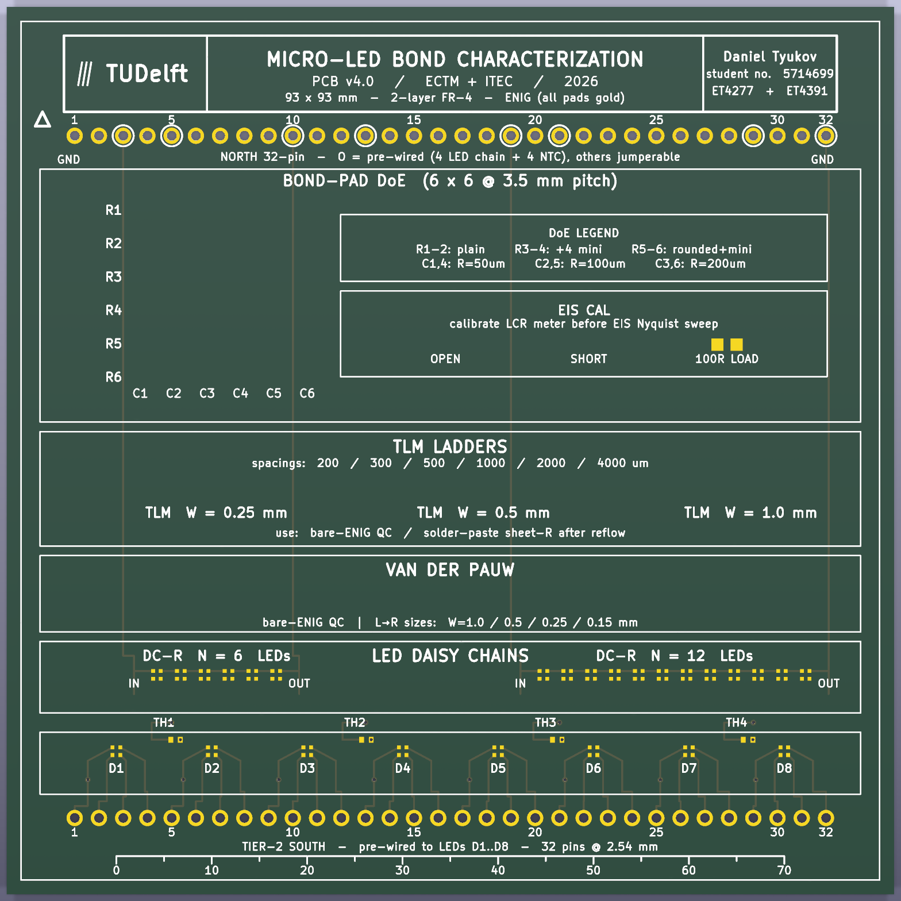
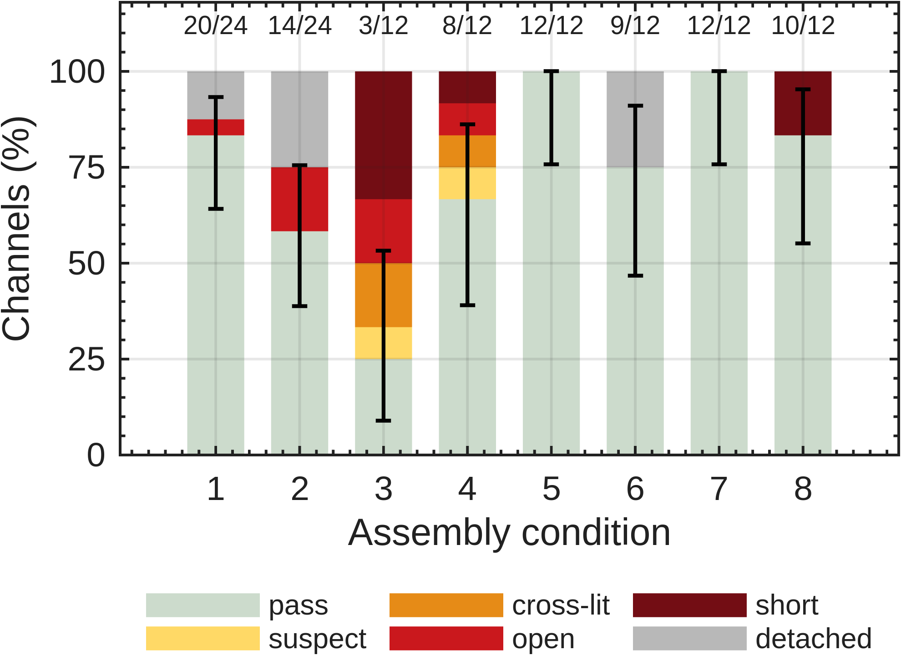
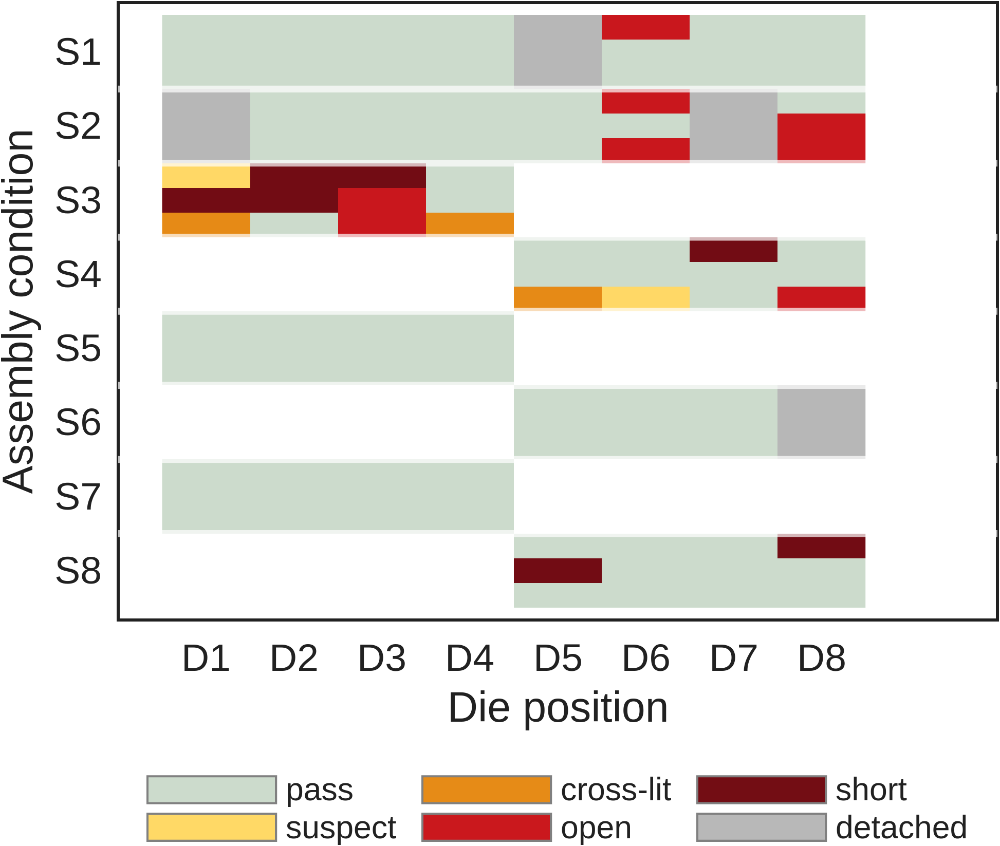
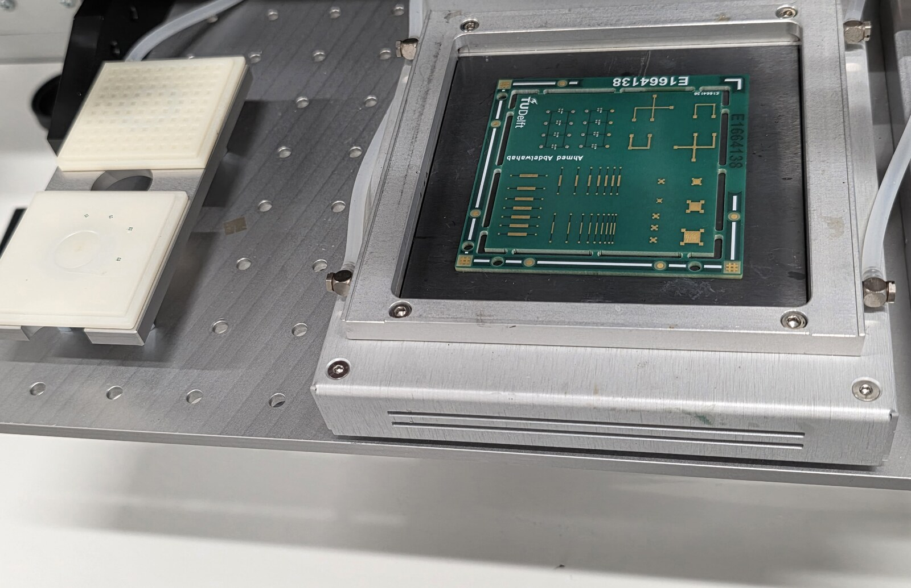
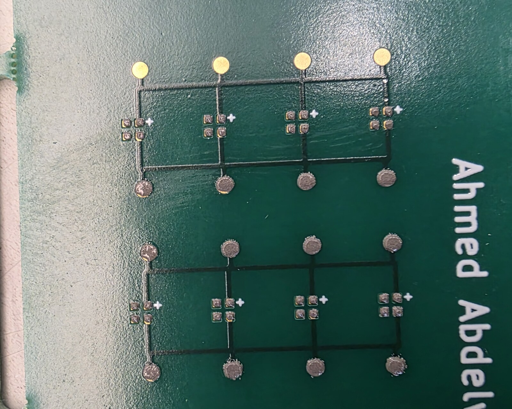
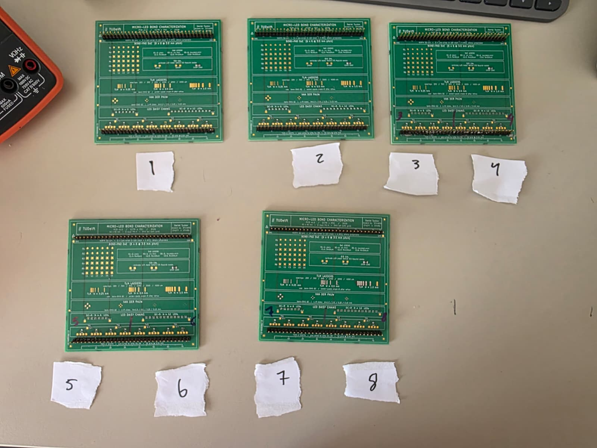
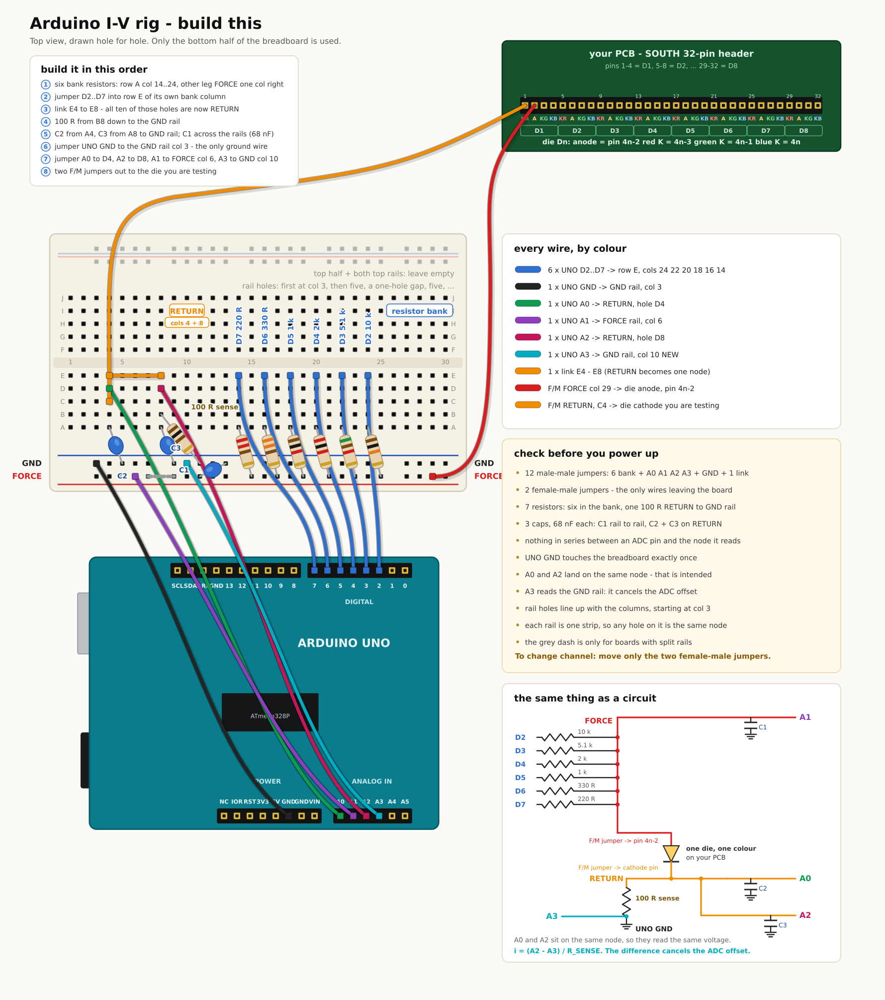
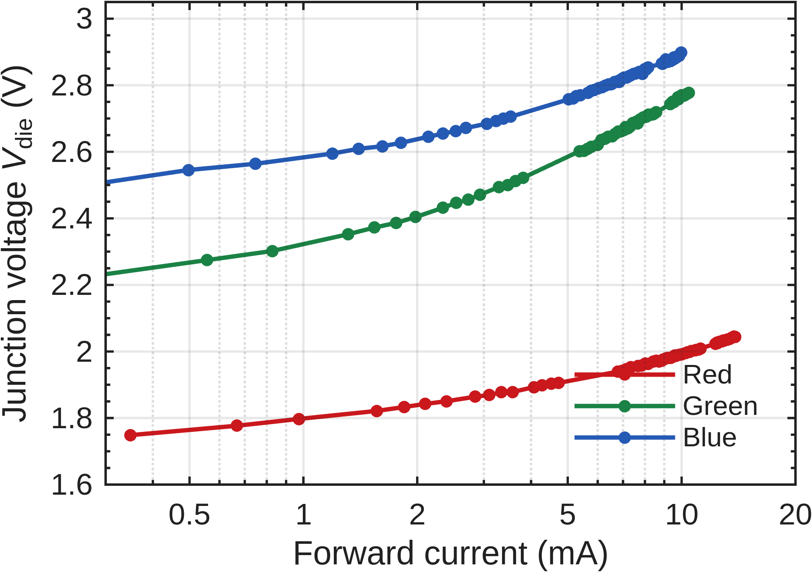
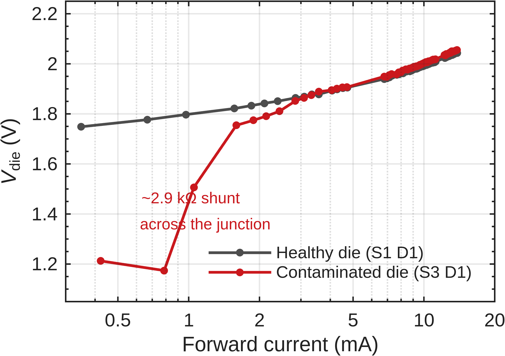

# Micro-LED Bonding Categorization

**A PCB test vehicle, a cleanroom bonding campaign, and an electrical characterization of eight micro-LED assembly conditions.**

TU Delft ECTM + ITEC B.V., February to August 2026. Course project (ET4277 + ET4391) and research contribution, supervised by M. Mastrangeli, H. van Zeijl and A. Abdelwahab, with R. van Hoorn and H. Kuipers (ITEC B.V. / Nexperia). Financed by ITEC B.V. and co-financed by RVO. Extends the v1 board published at [ECTC 2025](https://doi.org/10.1109/ECTC51687.2025.00363).

The question behind the work: when a ~1 mm² LED die is attached to a PCB without mounting pressure (pick-and-release / air-drop), how good is the resulting bond, and what instrument does it take to tell one bonding process from another?



---

## Headline result

**Yield and failure mode separate the eight assembly conditions. Series resistance cannot, and the reason is measured rather than assumed.**

| Condition | Channel yield | Failure modes | Assessment |
|---|---:|---|---|
| 1 | 83.3 % | 1 open, 3 detached | under-bonded |
| 2 | 58.3 % | 4 open, 6 detached | under-bonded |
| 3 | 25.0 % | 4 short, 2 open, 2 cross-lit, 1 suspect | over-bonded, 1 shunt confirmed |
| 4 | 66.7 % | 1 short, 1 open, 1 cross-lit, 1 suspect | over-bonded |
| 5 | **100 %** | none | in window |
| 6 | 75.0 % | 3 detached | under-bonded |
| 7 | **100 %** | none | in window |
| 8 | 83.3 % | 2 short | over-bonded, survivors clean |

A χ² test on the yield and failure-mode distribution gives p = 2.2 × 10⁻⁴. Conditions 5 and 7 lost nothing across every channel.

Series resistance does not discriminate: one-way ANOVA over the seven samples with n ≥ 3 gives F(6,21) = 1.96, not significant. Re-seating the same two jumpers on an unchanged channel moves R_s by **0.84 Ω**, which is 85 % of the apparent die-to-die spread, while the bond resistances being chased are **10 to 100 mΩ**. The experiment was never capable of resolving them, and the repeatability study is what proves it.

<table>
<tr>
<td width="50%"></td>
<td width="50%"></td>
</tr>
<tr>
<td>Yield and failure mode per condition, with Wilson intervals.</td>
<td>Defect map: every die position, every condition.</td>
</tr>
</table>

---

## The three parts of the work

### 1. Board design

A single 93 × 93 mm two-layer FR-4 board (ENIG, all pads gold) carrying every structure needed to characterize a bond on one substrate, so that one cleanroom session yields bond resistance, contact resistivity, sheet resistance and junction thermometry from the same hardware:

- **6 × 6 bond-pad design of experiments** at 3.5 mm pitch: three pad geometries (plain, four corner mini-pads, rounded + mini) crossed with three fillet radii (50 / 100 / 200 µm).
- **TLM ladders** at W = 0.25 / 0.5 / 1.0 mm with spacings 200 to 4000 µm, and **van der Pauw cloverleaves** at W = 1.0 / 0.5 / 0.25 / 0.15 mm.
- **26 Würth WL-SFCC 0404 RGB LEDs**: eight individually addressable, eighteen in 6- and 12-die daisy chains.
- **Four 0402 NTCs** for V_F-based junction thermometry, and an **LCR calibration set** (open / short / 100 Ω 0.1 %).
- Two 32-pin headers breaking every active net out to a breadboard.

Designed in KiCad 9, DRC-clean with full schematic parity, exported fab-ready to the Eurocircuits standard pool. The five SMT parts are reflowed by the fab; the 26 LED bond pads ship as bare gold, because the joint itself is the research subject and has to form under controlled conditions.

Sources, Python generators and the full fab package (gerbers, BOM, CPL, STEP, PDFs) are in [`new-pcb/`](new-pcb/). Report: [`part1/`](part1/ET4277_ET4391_DanielTyukov_5714699_part1_microLED_PCB_electrical_characterization.pdf).

### 2. Cleanroom bonding

Solder paste printed by hand through a 100 µm stencil, dies placed with a Tresky T-3000-PRO die bonder, joint formed on a hot plate with Sn42/Bi57.6/Ag0.4 (T_melt = 138 °C). When the paste melts, surface tension pulls each die toward the centre of its pad set. The same forces can tilt a die and lock it in a crooked position that never recovers, because tilt is the one non-restoring self-alignment mode for a rectangular chip.

<table>
<tr>
<td width="50%"></td>
<td width="50%"></td>
</tr>
<tr>
<td>Board fixtured in the Tresky T-3000-PRO.</td>
<td>Printed bond-pad array before placement.</td>
</tr>
</table>

The analytical contribution is reading the observed self-alignment and tilt against the capillary self-alignment literature to identify which process variable dominates. It is **solder volume**: manual stencil printing gives no volume metering, and volume is exactly the quantity the literature ties most strongly to both placement accuracy and the non-restoring tilt mode.

Report: [`part2/`](part2/ET4277_ET4391_DanielTyukov_5714699_part2_microLED_bonding_self_alignment_die_tilt.pdf). Session photos in [`part2/photos-during-lab2/`](part2/photos-during-lab2/), references in [`part2/downloaded_references/`](part2/downloaded_references/).

### 3. Electrical characterization

Eight blind-coded assembly conditions across five coupons, 40 dice bonded, 4 detached in handling, 36 measurable, 120 individual-die channels. Run as two rounds so that a cheap screen filtered the expensive one.



**Round 1, DMM screen.** Every channel screened for opens, shorts, cross-lighting and detachment with a handheld meter. It called six channels bad; the sweep rig later agreed on all six and disagreed on none in 89 sweeps.

**Round 2, current sweep.** An Arduino UNO rig switching a six-resistor bank (220 Ω to 10 kΩ) against a 100 Ω sense resistor, 63 current levels per sweep, fitting V = V₀ + n·V_T·ln(I) + I·R_s to each channel. 89 channel sweeps plus 9 re-seating repeatability runs.



<table>
<tr>
<td width="50%"></td>
<td width="50%"></td>
</tr>
<tr>
<td>Red, green and blue junctions of one die.</td>
<td>The defect only a current sweep could see.</td>
</tr>
</table>

Three findings about the measurement itself carried more weight than the bond numbers:

- **The ideality factor is a free defect detector.** Any channel fitting outside n = 1.2 to 2.4 has something in parallel with the junction, however normal its curve looks at working current. It caught a ~2.9 kΩ shunt on a contaminated die that the DMM passed at 1.781 V.
- **Green and blue are not fittable at 5 V.** With V_F near 2.8 V the rail leaves only a 20× current range, so V₀, n and R_s trade off and green fits at an unphysical n = 3.2 to 4.0. Red gets 30× and fits cleanly at n = 1.60 to 2.06. Red only.
- **Four instrument defects were found and fixed mid-campaign**, including a hardcoded oversampling shift that would have rescaled every voltage, a 14.4 mV common ADC offset worth 26 % current error at the bottom of the sweep, and an integer-truncated bandgap reference putting a 2 to 3 mV floor on every reading.

Full working log with per-channel results: [`RESULTS/R2_REPORT.md`](RESULTS/R2_REPORT.md). Packaged deliverable with figures, MATLAB and raw data: [`deliverable/`](deliverable/microLED_electrical_characterization/).

---

## Known limits

Stated up front, because they decide what these numbers can be used for.

| Limit | Consequence |
|---|---|
| Both voltage taps sit on the breadboard, not on the Tier-1 probe pads | Two female-male jumpers fall inside the measured loop. R_s is not usable for comparing bonds in this build. Kelvin sensing at the probe pads fixes it. |
| 5 V supply | Green and blue fits are unphysical. Red only. |
| Reverse bias measured through the meter's own 10 MΩ input impedance | Detects shunts below ~10 MΩ, cannot grade healthy dies. It confirmed the yield ranking rather than adding to it. |
| Daisy chains read open on every coupon | Layout fault, not a bonding failure: the dice sit rotated 90°, so the chain joins each die's red cathode to its blue cathode and leaves the anode floating. Fixed in the next revision. |
| One coupon carries uncleanable solder smear | Its readings characterize a post-process contamination failure and are excluded from V_F statistics. |
| No NTC readings collected | Ambient drift cannot be separated from self-heating at analysis time. |
| TLM, van der Pauw and impedance spectroscopy | Designed into the board, but the instruments were not available during the campaign. The structures are there for whoever has them. |

---

## Repository layout

| Path | Contents |
|---|---|
| [`new-pcb/`](new-pcb/) | v4 KiCad project, Python generators, Eurocircuits fab package, design notes |
| [`part1/`](part1/) | Board design and characterization-methodology report, project archive, fab quote |
| [`part2/`](part2/) | Bonding process report, cleanroom photos, self-alignment literature |
| [`FINAL_MEASUREMENTS/`](FINAL_MEASUREMENTS/) | Bench procedures, Arduino rig build drawings, MATLAB analysis, figures |
| [`RESULTS/`](RESULTS/) | Raw round 1 and round 2 data, per-channel results, round 2 report |
| [`measurements/`](measurements/) | Measurement plan, equipment limits, sample inventory, decision log |
| [`deliverable/`](deliverable/) | Self-contained characterization package: report, figures, code, data |
| [`old-pcb/`](old-pcb/) | v1 board (ECTC 2025), kept for reference |
| [`docs/`](docs/) | Datasheets, published papers, patent, collaboration notes |
| [`PROJECT_DETAILS.md`](PROJECT_DETAILS.md) | Full project context, v1 board teardown, literature notes |

## Reproducing the analysis

```
cd deliverable/microLED_electrical_characterization/matlab
matlab -batch figures
```

Reads `../data/`, refits every sweep, writes all eight figures, and prints every number quoted in the report. MATLAB R2025b with the Statistics and Machine Learning Toolbox (`anova1`, `chi2cdf`).

Board previews and fab outputs regenerate from `new-pcb/tools/`; see [`new-pcb/README.md`](new-pcb/README.md) and [`new-pcb/FABRICATION_ORDER.md`](new-pcb/FABRICATION_ORDER.md) for the ordering workflow.

## Reports

| Report | File |
|---|---|
| Part 1: A PCB Test Board for Electrical Characterization of Solder-Bonded Micro-LEDs | [PDF](part1/ET4277_ET4391_DanielTyukov_5714699_part1_microLED_PCB_electrical_characterization.pdf) |
| Part 2: Solder-Paste Printing and Die-Bonder Placement of Micro-LEDs, Capillary Self-Alignment and Die Tilt | [PDF](part2/ET4277_ET4391_DanielTyukov_5714699_part2_microLED_bonding_self_alignment_die_tilt.pdf) |
| Electrical characterization section (group deliverable) | [PDF](deliverable/Electrical_Characterization_section.pdf) |

## Tooling

KiCad 9, Python (fab, BOM and drawing generators), MATLAB R2025b, Arduino UNO / ATmega328P firmware, Eurocircuits PCB + PCBA, Tresky T-3000-PRO die bonder, eC-stencil-mate, handheld DMM.

## Credits

Daniel Tyukov (student no. 5714699), MSc Microelectronics, TU Delft. Supervision and cleanroom training: A. Abdelwahab, H. van Zeijl, M. Mastrangeli (TU Delft ECTM). Industrial partner: R. van Hoorn, H. Kuipers (ITEC B.V. / Nexperia). The v1 board and the pick-and-release method are the work of Abdelwahab et al., ECTC 2025, DOI [10.1109/ECTC51687.2025.00363](https://doi.org/10.1109/ECTC51687.2025.00363).
